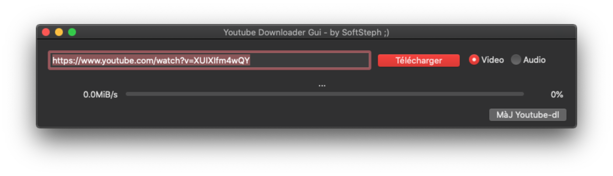

# Xojo-YoutubeDlGui by SoftSteph ;)
Youtube Downloader Gui made with Xojo 2021+ // MacOs et Windows

Fonctionnalites :
- Permet de télécharger des vidéos Youtube
- Permet de les convertir au format Mp4 (Video + Audio) ou Mp3 (Audio seul)
- Les vidéos sont téléchargées dans le répertoire de l'application
- Mise à jour possible de l'executable youtube-dl.exe
- Fonctionne sous Windows et sur MacOs (avec FFmpeg et FFprobe installés dans usr/local/bin/ffmpeg)

Fichiers requis pour faire fonctionner le programme :
- youtube-dl.exe (le programme peut télécharger automatiquement la dernière version)
- ffmpeg.exe (à récupérer sur Internet - https://www.gyan.dev/ffmpeg/builds/)
- ffprobe.exe (à récupérer sur Internet - https://www.gyan.dev/ffmpeg/builds/)

Si vous aimez mes programmes, <a href="https://www.paypal.com/donate/?hosted_button_id=GY5LTDDPZ2HZG"> vous pouvez faire un don PayPal ;)</a>

Historique des versions :

v0.5 du 06/09/2002
Première version sous MacOs fonctionnelle
Detection du Titre de la Video Youtube si disponible

v0.4 du 04/09/2022
Détection de présence de FFmpeg et message d'erreur si non présent
Téléchargement de Youtube-dl en fonction de Windows ou MacOs

v0.3 du 04/09/2022
Barre de progression du téléchargement

v0.2 du 03/09/2022
Première version fonctionnelle sous Windows
